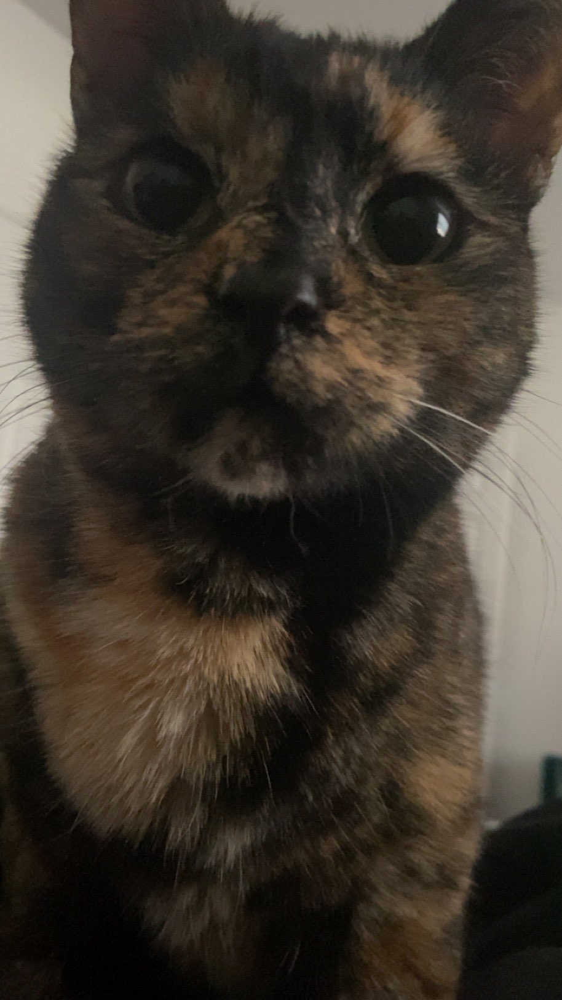

<meta name="keywords" content="Brandon Mullins">
<html lang="en">
<head>
    <meta charset="UTF-8">
    <meta name="viewport" content="width=device-width, initial-scale=1.0">
    <title>Your Scholarship Application Website</title>
    
</head>
<body>

    <header>
        

            <h1>Brandon Mullins</h1>
            
Contact: mullinsbrandon885@gmail.com | Phone: 269-464-6816

        

    </header>

    <main>
        <section id="about">
            <h2>About Me</h2>
            

 <!-- Add a white pillar behind the text -->
            

                
I am a College Student who is majoring in computer science with a particular interest in cybersecurity and penetration testing.

                
My hobbies include but are not limited to gaming, various personal projects (usually involving cybersecurity or computers and electronics in general), cooking, and playing Dungeons and dragons with my friends.

            

        </section>

        <section id="achievements">
            <h2>Achievements</h2>
            

            

                <ul>
                    <li>Several Certifications pertaining to IT such as</li>
                    <li>Microsoft Technology Associate (MTA) Security Fundamentals</li>
                    <li>MTA Windows OS fundamentals</li>
                    <li>TestOut IT fundamentals</li>
                    <li>TestOut Online Safety and Security</li>
                    <li>TestOut IT fundamentals</li>
                    <li>TestOut Security</li>
                    <li>TestOut Ethical Hacking</li>
                    <li>A less formal Achievement of mine is jailbreaking a locked down control module for a robotics competition. Allowing it to be used after the competition was over.</li>
                </ul>
            

        </section>

        <section id="extracurricular">
            <h2>Extracurricular Activities</h2>
            

            

                <ul>
                    <li>Playing Dungeons and Dragons with my friends</li>
                    <li>Reading up on Cybersecurity related topics (news, software, etc)</li>
                    <li>Coding various programs or scripts.</li>
                </ul>
            

        </section>

        <section id="cats">
            <h2>My Cats</h2>
            

            

                

                    <h3>Finn</h3>
                    
                    
                

                

                    <h3>Hadrian</h3>
                    
                    
                

                

                    <h3>Ocatavia</h3>
                    
                    
                

            

        </section>

        <section id="goals">
            <h2>Career Goal</h2>
            

            

                
My Career goal overall is to get into the cybersecurity field of IT and continue to develop my skills both career wise as well as for my hobbies.

            

        </section>
    </main>

    <footer>
        
Contact: mullinsbrandon885@gmail.com | Phone: 269-464-6816

    </footer>

    

</body>
</html>
